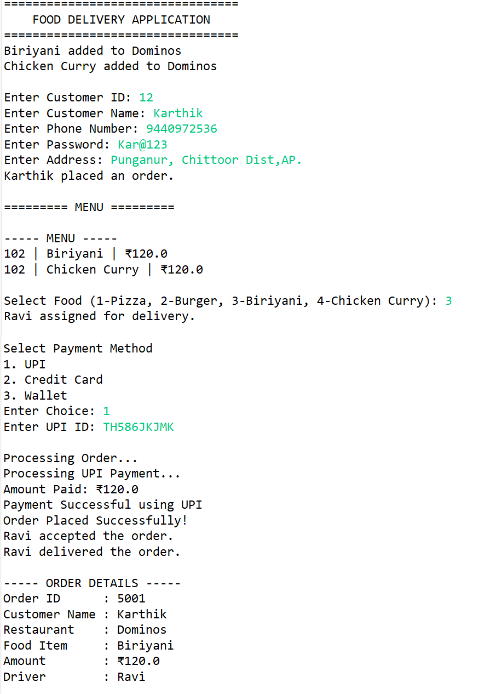

# Food Delivery App Backend

## 📌 Project Overview

Food Delivery App Backend is a Java-based console application that simulates the core workflow of food delivery platforms such as Zomato and Uber Eats.

The system models the interaction between customers, restaurants, drivers, and multiple payment methods while demonstrating the four fundamental Object-Oriented Programming (OOP) concepts:

* Encapsulation
* Inheritance
* Abstraction
* Polymorphism

---

## 🚀 Features

* Customer Registration
* Restaurant Menu Management
* Food Ordering System
* Driver Assignment
* Multiple Payment Methods

  * UPI Payment
  * Credit Card Payment
  * Digital Wallet Payment
* Order Processing
* Order Details Display
* Dynamic User Input using Scanner

---

## 🛠️ Technologies Used

* Java
* Eclipse IDE
* OOP Concepts
* Collections (ArrayList)
* Scanner Class
* Git & GitHub

---

## 🏗️ Project Structure

```text
FoodDeliveryApp
│
├── src
│   ├── com.fooddelivery.main
│   ├── com.fooddelivery.users
│   ├── com.fooddelivery.payment
│   ├── com.fooddelivery.restaurant
│   ├── com.fooddelivery.order
│   └── com.fooddelivery.driver
│
├── Asset
│   └── FoodDeliveryApp_Output.png
│
└── README.md
```

---

## 📚 OOP Concepts Implemented

### 1. Encapsulation

Sensitive data such as passwords, payment credentials, and driver information are declared as private variables and accessed through methods.

### 2. Inheritance

Customer, Driver, and RestaurantOwner classes inherit common properties and methods from the User class.

### 3. Abstraction

The PaymentMethod interface defines common payment behavior while hiding implementation details.

### 4. Polymorphism

Different payment methods such as UPI, Credit Card, and Wallet implement the same interface and are processed dynamically at runtime.

---

## 🔄 Application Flow

```text
Customer
    ↓
Restaurant Menu
    ↓
Food Selection
    ↓
Order Creation
    ↓
Payment Processing
    ↓
Driver Assignment
    ↓
Order Delivery
```

---

## 🖥️ Sample Output



---

## 🎯 Future Enhancements

* MySQL Database Integration
* Spring Boot REST APIs
* User Authentication & Authorization
* Order Tracking System
* Ratings and Reviews
* Admin Dashboard
* Notification System

---

## 👨‍💻 Author

Karthik

GitHub: https://github.com/Karthik2536
